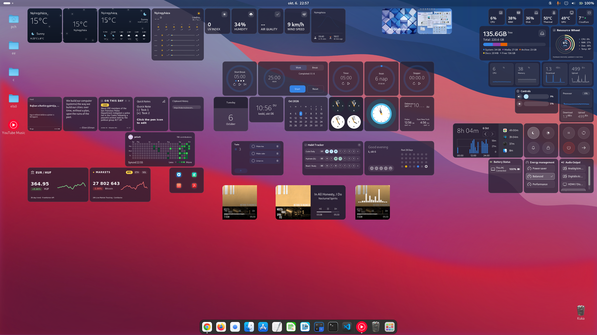

# Grid Desktop

A customizable desktop widget extension for GNOME Shell, providing an interactive, density-adaptive grid on your desktop canvas.

---

## Features

- **Dynamic Grid Scaling:** Automatically adapts to any screen resolution and aspect ratio — full support for standard 16:9 displays and Ultrawide (21:9 / 32:9) monitors.
- **Smart Multi-Monitor Support:** Cleanly handles display topology changes (docking, undocking, laptop lid open/close) across Wayland and X11 sessions.
- **Interactive Widgets:** Weather, System Monitors, Media Player, Quick Notes, Screen Time, and more.
- **Precision Alignment:** Snap-to-grid placement with dynamic collision avoidance.
- **Customizable Appearance:** Full support for Adwaita light/dark modes and system accent colors.

---

## Compatibility

- **GNOME Shell:** 45, 46, 47, 48
- **Display Server:** Wayland (recommended) & X11

---

## Manual Installation

1. Clone the repository:
git clone https://github.com/pelach/grid-desktop.git
cd grid-desktop

2. Install to GNOME Extensions directory:
mkdir -p ~/.local/share/gnome-shell/extensions/grid-desktop@pelach.github.com
cp -r * ~/.local/share/gnome-shell/extensions/grid-desktop@pelach.github.com/

3. Restart GNOME Shell and Enable:

X11: Press Alt + F2, type r, and press Enter.

Wayland: Log out and log back in.

4. Enable the extension:
gnome-extensions enable grid-desktop@pelach.github.com

## Development and Debugging
To monitor extension logs in real-time:
journalctl -f -o cat /usr/bin/gnome-shell | grep -E "grid-desktop|DesktopGrid"

To recompile schemas after updating org.gnome.shell.extensions.grid-desktop.gschema.xml:
glib-compile-schemas schemas/

## Acknowledgments
Based on the original Gridgets extension by rebatnaath.

Refactored, enhanced, and maintained by András Pelach (with development assistance from Google Gemini).

## License
This project is licensed under the GPL-3.0 License.
